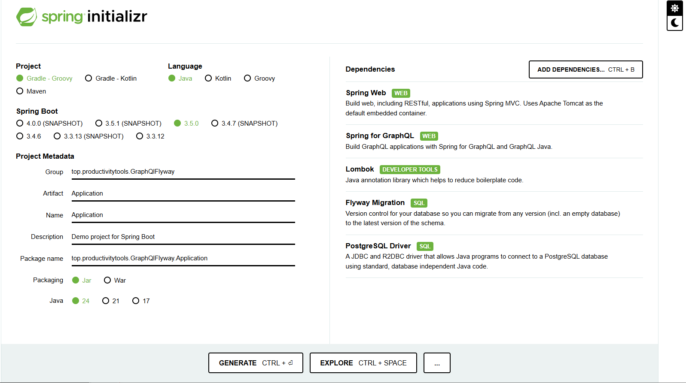
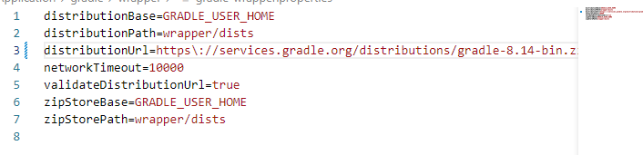
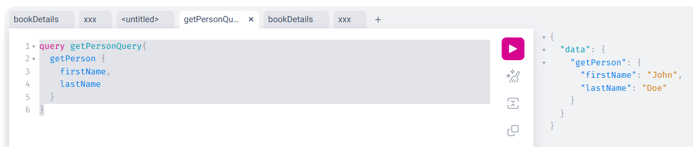

- https://start.spring.io/
- dependencies:
    - Spring Web
    - Spring for GraphQL
    - Lombok
    - Flyway Migration
    - PostgreSQL Driver



Update ```gradle-wrapper.properties``` to 8.15



invoke ```.\gradlew.bat wrapper```

Invoke ```.\gradlew.bat build```

Do as in the [tutorial](https://github.com/ProductivityTools-Learning/ProductivityTools.Learning.Java.Flyway)

```
.\gradlew.bat bootrun
```

Open [page](http://localhost:8080/graphiql?path=/graphql)

invoke
```
query getPersonQuery{
  getPerson {
    firstName,
    lastName
  }
}
```
